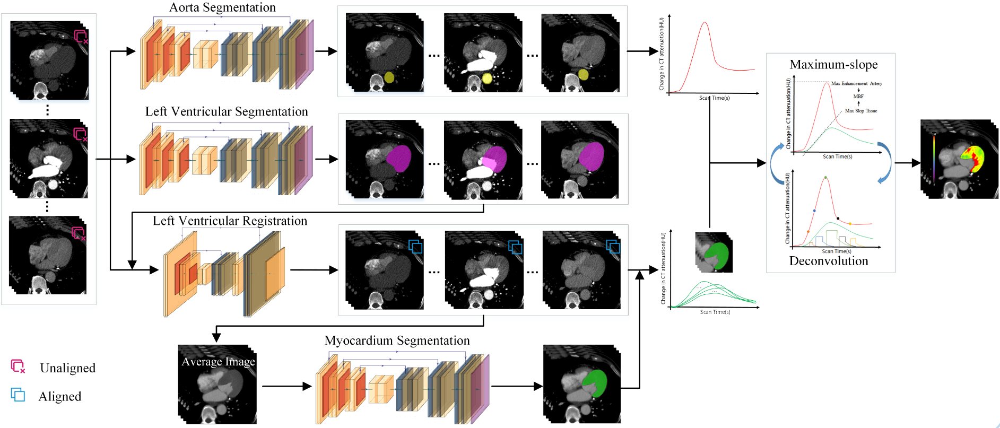
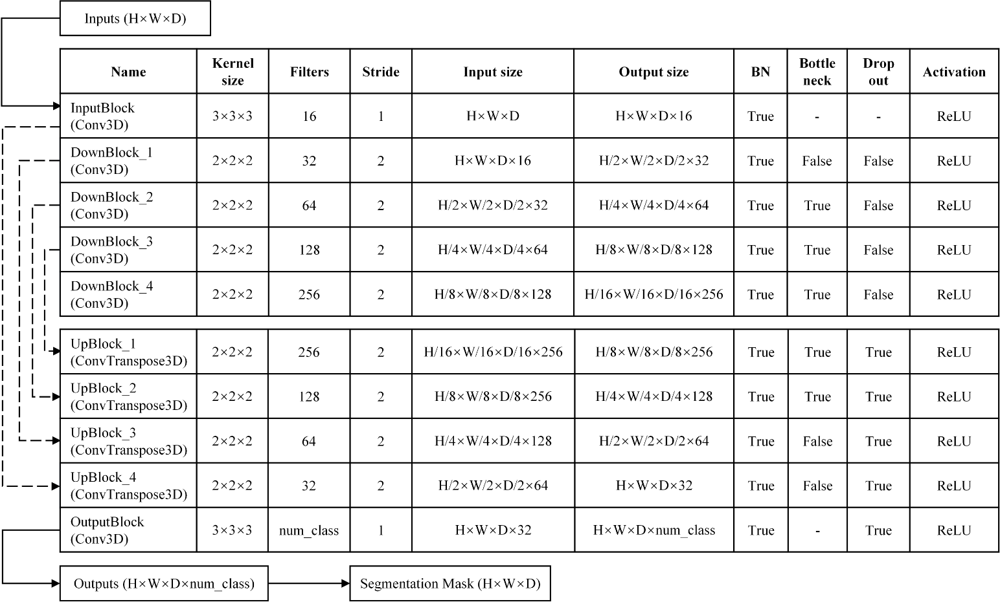
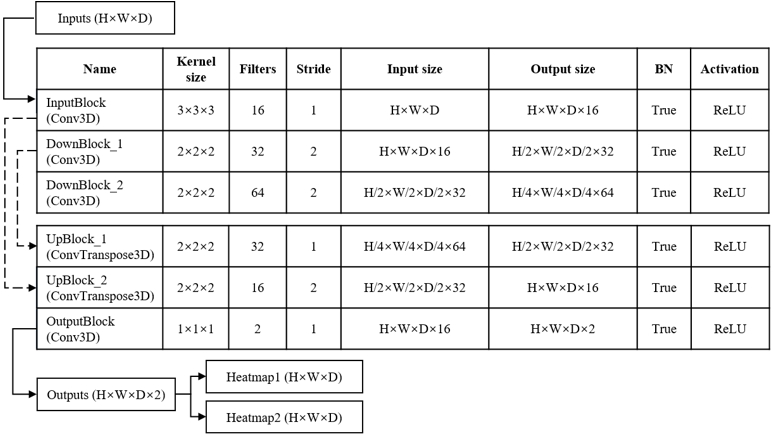
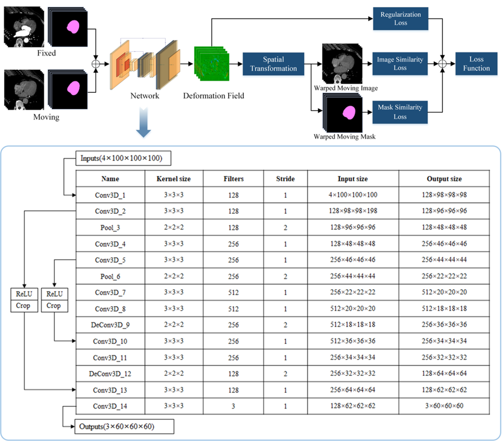

# DL-CT-Myocardial-Perfusion

## Introduction
This repository is the official implementation of Deep learning model for "Deep learning-based quantitative CT myocardial perfusion imaging and risk stratification of coronary artery disease".

In this work, we developed an automatic system for ischemic myocardial volume (IMV) quantification and major adverse cardiovascular event (MACE) prediction using dynamic CT myocardium perfusion images as input. In this system, three deep-learning based models were trained and utilized to facilitate the automatic quantification process, namely segmentation model, landmark detection model and registration model. Here in this repository, we share the source code illustrating the model architecture structures and loss functions.

Figure 1. Pipeline of deep-learning based automated MBF quantification 

## Segmentation Model

Figure 2. Illustration of the Segmentation Model

The Segmentation Model trained in this system is VB-Net, which is a modification of U-Net. The structure of this network is illustrated in Figure 2 and the PyTorch implementation of this model can be found in */segmentation* folder of this repostory. 

## Landmark Detection Model

Figure 3. Illustration of the Landmark Detection Model

The network architecture of the Landmark Detection Model is depicted in Figure 3. Each landmark was projected onto a heatmap using a Gaussian kernel as the ground truth. The input to the model was the cropped left ventricle from the average CTP image, and the model concurrently producing produced heatmaps for two landmarks, where the detected landmark was determined as the point with the highest probability value in the heatmap. Model structure of the Landmark Detection Model can be found in */landmark_detection* folder. 

## Registration Model

Figure 4. Illustration of the Registration Model

Training workflow of the proposed Registration Model is shown in Figure 4. The model receives input images of the fixed and moving frames, along with left ventricular masks for both frames, and generates a 3D deformation field to align the moving image with the fixed image. Model structure of the Registration Model can be found in */registration* folder.
